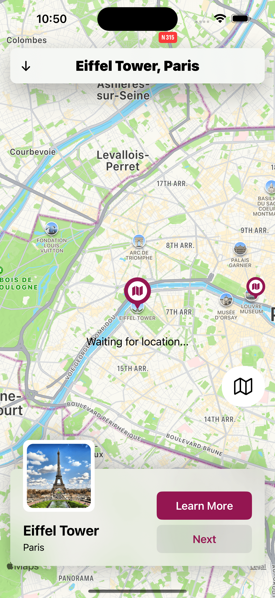
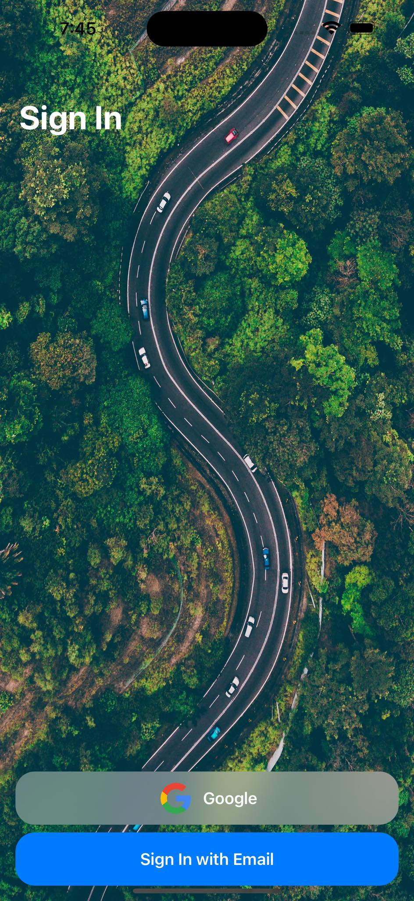

&nbsp;&nbsp;&nbsp;&nbsp;&nbsp;&nbsp;

<!-- # Hello!
*Thanks for stopping by*. This repo serves as a kind of ever-changing portfolio of projects I'm currently excited about; please feel free to look around. -->

# SwiftUIMapApp

It's a map app showing different locations.

&nbsp;&nbsp;&nbsp;&nbsp;&nbsp;&nbsp;&nbsp;&nbsp;&nbsp;&nbsp;

# SwiftUIXFirebase

It's a app that use firebase products like Firebase Auth, Firebase FireStore.

&nbsp;&nbsp;&nbsp;&nbsp;&nbsp;

## Thanks for stopping by!

# Contact Info:

- Email: officials.mirza@gmail.com
- LinkedIn: [Mirza Showvik](https://www.linkedin.com/in/mirzashowvik/)
- Website: [mirzashowvik](https://linktr.ee/mirzashowvik)
